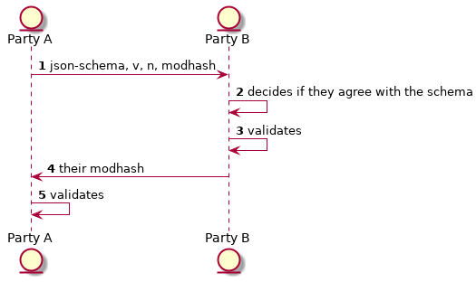

# zkintel

Zero-Knowledge comparison framework for threat intelligence information 

## Why?

I watched [this cool talk](https://cfp.recon.cx/reconmtl2019/talk/ZAMV39/) at Recon Montreal this year, and it seemed like there was an issue in threat investigators "showing their hand" prior to coordinating efforts.

So I was thinking could you use a zero-knowledge-proof so party A (e.g. an Antivirus Vendor) can coordinate with party B (e.g. local government). This could then lead to some collaboration or information sharing once you've safely agreed you're talking about the same threat actors.

## How?

Some prereading, my SRPv6a [slides](https://www.josephkirwin.com/srp-talk/#/setup), as this will leverage a partial homomorphic aspect to do the proof.

If you want to compare something usually you can subtract one from another and if the result is zero they were the same value. So you can construct this via exponents.

 v^0 = 1 \ when \ i=j" width="40%"/><br/>


Where v is shorthand for this function    
<br> g^x \mod n" width="30%"/>

where n is a large prime number, g is a coprime (A base with property [GCD](https://en.wikipedia.org/wiki/Greatest_common_divisor)(g,n) = 1) that has the same power periodicity in n. Visual demo of what I mean on [this slide](https://www.josephkirwin.com/srp-talk/#/4/1) of my srp talk

So, given that we can compare two things opaquely using the above technique we could then hash some normalized input, we can do this by each party agreeing upon a json-schema that they will use to compare the information

## Using

```
$ go run zkintel.go -createProof -path example.json
```

will return you 
```
{
    "modular-multiplicative-generator": "2",
    "prime": "eeaf0ab9adb38dd69c33f80afa8fc5e86072618775ff3c0b9ea2314c9c256576d674df7496ea81d3383b4813d692c6e0e0d5d8e250b98be48e495c1d6089dad15dc7d7b46154d6b6ce8ef4ad69b15d4982559b297bcf1885c529f566660e57ec68edbc3c05726cc02fd4cbf4976eaa9afd5138fe8376435b9fc61d2fc0eb06e3",
    "modular-hash": "7bcdbb3dd8df869e978c98336a4a5a41c8ba0c74ccfe022f9e2263003bfda98385797dae0a077c11c44febf0d129e9349fa20c84d9d9ec9d5d23ad713fdcd253b7155941d5fc6c3cacbc56fe4b4554430a6ea47d7f27340d8295a7620fc02e52e30f9e56b072cbe433e4df55c316bc47da4747c6c8e0dbe0f5a58d667cffdce3"
}
```

which if you store to a received.json file you can then compare to the original via

```
go run zkintel.go -path example.json -cmpPath received.json
```

## Proposed information flow



## Caveats

If you were actually to use this in ANGER, there'd need to be some other salt/noise in the scheme for additional security, [similar to SRPv5](https://www.josephkirwin.com/srp-talk/#/1/3)
